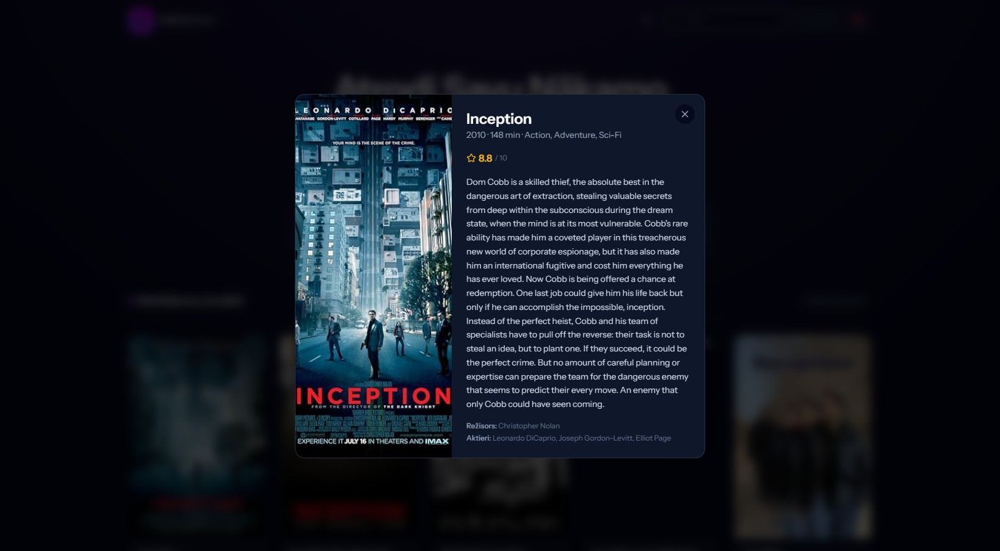
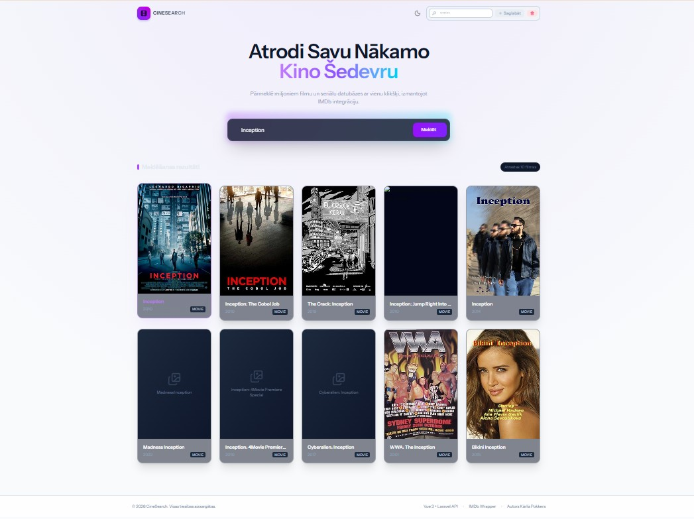
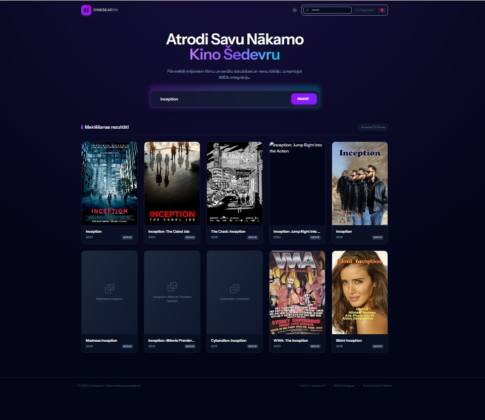

# CineSearch

Filmu meklēšanas tīmekļa lietotne, kas izmanto [OMDB API](http://www.omdbapi.com/) filmu datu iegūšanai. Izstrādāta kā tehniskais uzdevums PHP programmētāja amatam SIA RGP.

## Funkcionalitāte

- Filmu meklēšana pēc nosaukuma, izmantojot OMDB API
- Pēdējo 5 meklēšanas vaicājumu saglabāšana (sesijas ietvaros)
- Meklēšanas rezultātu attēlošana kartīšu veidā
- Paplašināta informācija par izvēlēto filmu modālajā logā (plakāts, apraksts, IMDb vērtējums, režisors, aktieri u.c.)
- Personalizēts OMDB API tokens (glabājas sesijā, nevis globālajā konfigurācijā)
- Rezultātu kešošana ātrākai atkārtotai meklēšanai
- Pest testi (unit un feature)

## Tehnoloģiju steks

**Backend:** Laravel 13 (PHP 8.4+), Inertia.js, PostgreSQL, Pest

**Frontend:** Vue 3 (Composition API, `<script setup>`, TypeScript), Tailwind CSS, Lucide ikonas, Vite

**Infrastruktūra:** Docker + Docker Compose, Nginx + PHP-FPM, GitHub Actions CI

## Projekta struktūra

```
├── app/
│   ├── Http/Controllers/
│   │   ├── SiteController.php          # Galvenā (Index) lapa
│   │   ├── SearchController.php        # Meklēšanas apstrāde
│   │   ├── ApiTokenController.php      # OMDB tokena saglabāšana/dzēšana sesijā
│   │   └── MovieDetailsController.php  # Filmas detalizēta info (modālajam logam)
│   ├── Services/
│   │   └── OmdbService.php             # OMDB API klients (cache, kļūdu apstrāde)
│   ├── Models/
│   │   └── SearchHistory.php           # Meklēšanas vēsture (pēdējie 5 vaicājumi)
│   └── Exceptions/
│       └── OmdbException.php
├── resources/js/
│   ├── pages/
│   │   └── Index.vue                   # Galvenā lapa
│   └── components/project/
│       ├── Header.vue
│       ├── Logo.vue
│       ├── ApiTokenInput.vue
│       ├── FilmSearch.vue              # Meklēšanas josla + vēstures dropdown
│       ├── MovieCard.vue
│       └── MovieModal.vue              # Filmas detaļu modālis
├── tests/
│   ├── Feature/
│   │   ├── SearchControllerTest.php
│   │   └── ApiTokenControllerTest.php
│   └── Unit/
│       ├── Services/OmdbServiceTest.php
│       └── Models/SearchHistoryTest.php
├── docker/
│   ├── Dockerfile                      # PHP-FPM app konteiners
│   ├── app/entrypoint.sh
│   ├── app/php-dev.ini
│   ├── nginx/default.conf
│   └── node/Dockerfile                 # Node + PHP CLI (Vite + Wayfinder)
├── docker-compose.yml
└── .github/workflows/tests.yml
```

## Priekšnosacījumi

- [Docker](https://www.docker.com/) un Docker Compose
- Bezmaksas OMDB API atslēga: [omdbapi.com/apikey.aspx](http://www.omdbapi.com/apikey.aspx)

Viss pārējais (PHP, Composer, Node, PostgreSQL) darbojas konteineros — lokāli nekas papildu nav jāinstalē.

## Uzstādīšana un palaišana lokāli

1. **Klonē repozitoriju**
```bash
git clone <repo-url>
cd SIA_RGP_TECH_TASK
```

2. **Izveido `.env` failu**
```bash
cp .env.example .env
```

Aizpildi datubāzes iestatījumus (der arī noklusējuma vērtības, ja neesi mainījis `docker-compose.yml`):

```
DB_CONNECTION=pgsql
DB_HOST=postgres
DB_PORT=5432
DB_DATABASE=sia_rgp_tech_task
DB_USERNAME=laravel
DB_PASSWORD=secret
```

Pievieno savu OMDB API atslēgu (var arī atstāt tukšu un ievadīt to vēlāk tieši lietotnes saskarnē):

```
OMDB_API_KEY=tava_atslega_seit
```

3. **Palaid konteinerus**
```bash
docker compose up --build
```

4. **Uzstādi backend atkarības un sagatavo aplikāciju** (atsevišķā termināļa logā, kamēr konteineri darbojas)
```bash
docker compose exec app composer install
docker compose exec app php artisan key:generate
docker compose exec app php artisan migrate
```

5. **Atver lietotni**

Pārlūkā dodies uz [http://localhost:8000](http://localhost:8000)

> Vite dev serveris darbojas `http://localhost:5173` fonā (HMR nodrošināšanai) — to nav nepieciešams atvērt tieši.

### OMDB API atslēga

Lietotnē ir iespējams ievadīt savu OMDB API tokenu tieši galvenē (ikona ar atslēgu) — tas tiek saglabāts sesijā un izmantots meklēšanai. Ja tokens nav norādīts, tiek izmantota `.env` faila `OMDB_API_KEY` vērtība kā noklusējums.

## Testu palaišana

```bash
docker compose exec app ./vendor/bin/pest
```

vai

```bash
docker compose exec app php artisan test
```

Testi izmanto SQLite in-memory datubāzi un `Http::fake()`, lai netiktu veikti reāli pieprasījumi uz OMDB API.

## CI/CD

Katrs push/pull request uz `main` zaru automātiski palaiž Pest testu komplektu, izmantojot GitHub Actions ([`.github/workflows/tests.yml`](.github/workflows/tests.yml)).

## Ekrānuzņēmumi

### Filmas detaļas


### Gaišais/tumšais režīms
<table>
  <tr>
    <td></td>
    <td></td>
  </tr>
</table>

## Autors

Kārlis Pokkers — SIA RGP Tech tehniskais uzdevums
